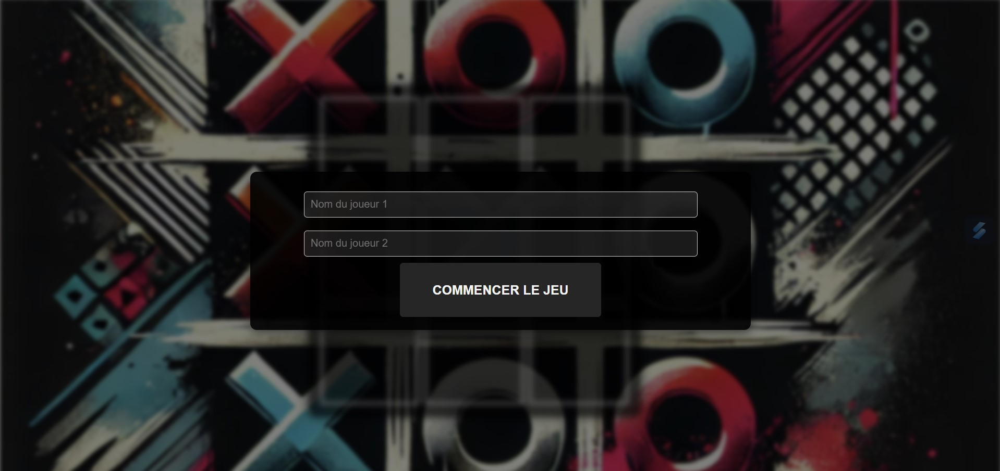
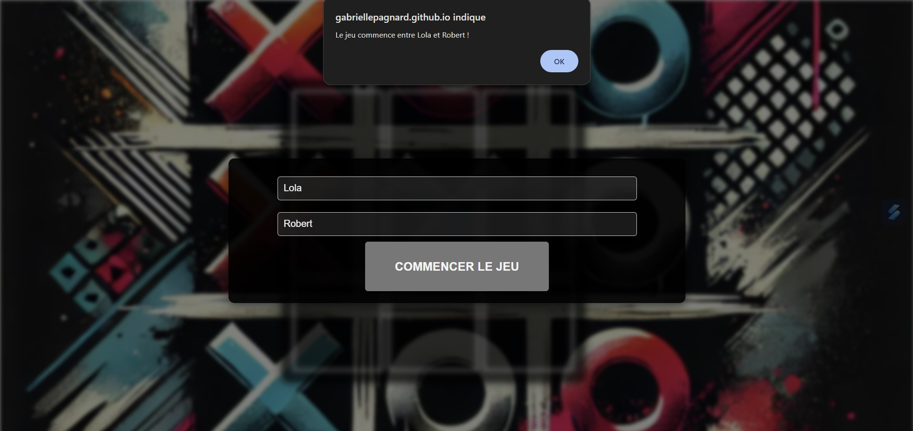
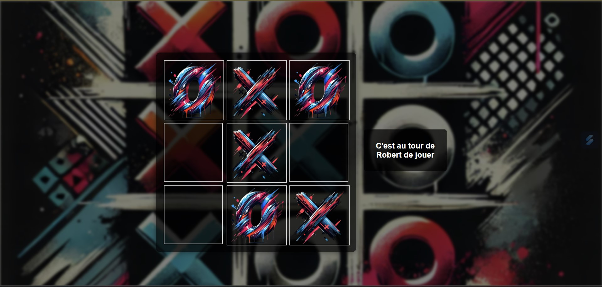
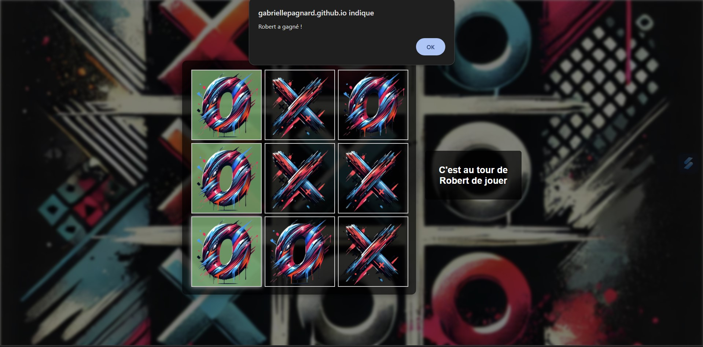
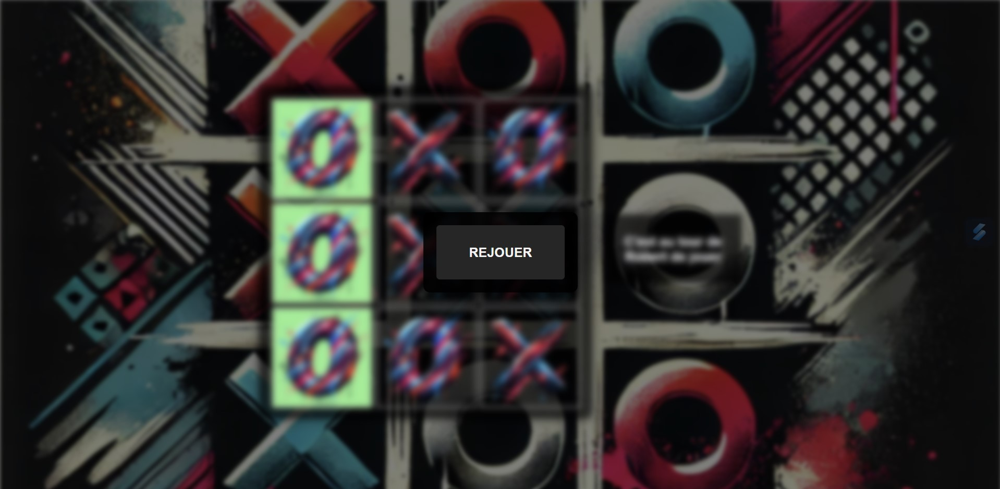

# 🎮 Jeu du Morpion (Tic Tac Toe) 🎮

 

## 📜 Présentation

Bienvenue dans le projet Jeu du Morpion ! Ce jeu classique de morpion (ou tic-tac-toe) a été modernisé avec un design élégant et interactif, offrant une expérience utilisateur captivante pour jouer à deux.   

 
 

## ✨ Fonctionnalités Principales

🧑‍🤝‍🧑 Mode multijoueur : Jouez contre vos amis en entrant vos noms et en vous affrontant tour par tour   
🔄 Réinitialisation rapide : Possibilité de rejouer immédiatement après une partie grâce à une pop-up de redémarrage   
🎨 Interface stylisée : Un arrière-plan artistique et un design épuré rendent chaque partie aussi agréable à regarder qu'à jouer   
📊 Indicateur de tour : Affichage en temps réel du joueur actuel, pour une expérience de jeu plus claire    
🔍 Effet de flou : Application d'un effet de flou sur la grille lors des transitions pour une touche visuelle sophistiquée   
🏆 Détection des victoires : Le jeu met en évidence les combinaisons gagnantes et annonce le vainqueur de manière claire   

 
 

## 📸 Aperçu

Voici à quoi ressemble l'application :   

   

   

   

   

   

[Démo vidéo du projet 🎥](https://www.youtube.com/watch?v=YpDL0R0R4lw)

 
 

## 🌐 Lien direct

Pour l'utiliser : [Morpion 🎮](https://gabriellepagnard.github.io/Morpion/)   

 
 

## 🔧 Technologies Utilisées

- HTML 🏗️    
- CSS 🎨   
- JavaScript ⚙️   

 
 

## 📂 Fichiers du Projet

- index.html : Structure du jeu   
- style.css : Feuille de style personnalisée   
- app.js : Script pour la logique du jeu    
- ressources/ : Images et ressources pour l'interface   

 
 

## 🛠️ Installation et Utilisation

Pour démarrer avec Jeu du Morpion, suivez ces étapes simples :   

➡️ Clonez le Répertoire :   

`git clone https://github.com/votre-utilisateur/morpion.git`   

➡️ Accédez au Répertoire :   

`cd morpion`   

➡️ Ouvrez le Fichier "index.html" dans votre navigateur pour voir l'application en action   

➡️ Personnalisez le Code selon vos besoins ou apportez des contributions !   

 
 

## 🏗️ Comment Contribuer

Vous souhaitez contribuer ? 🎉 Voici comment faire :   

### Créer une Branche 🌿

➡️ Pour chaque nouvelle fonctionnalité ou correction, créez une nouvelle branche :   

`git checkout -b nom-de-la-branche`   

### Faire vos Changements ✏️   

Apportez les modifications nécessaires et committez-les :   

`git add .`   
`git commit -m "Description des changements"`   

### Pousser les Changements ⬆️   

Envoyez vos modifications à GitHub 📨 :

`git push origin nom-de-la-branche`   

### Créer une Pull Request 🔄   

Allez sur GitHub, ouvrez une Pull Request et expliquez vos modifications   

 
 

## 🤝 Contributeurs/trices

Gabrielle Pagnard 🧑‍💻 - Créatrice du projet

 
 

## 📬 Contact

Pour toute question ou suggestion, n'hésitez pas à me contacter :   

Email : gpagnard@gmail.com   
GitHub : [GabriellePagnard](https://github.com/GabriellePagnard)     

 
 
 

Merci d'avoir visité le projet Morpion ! 🚀   

Nous espérons que vous vous amuserez autant en jouant au Jeu du Morpion que nous avons eu à le développer ! 🎉 
N'hésitez pas à laisser un ⭐ si vous aimez ce projet !    
